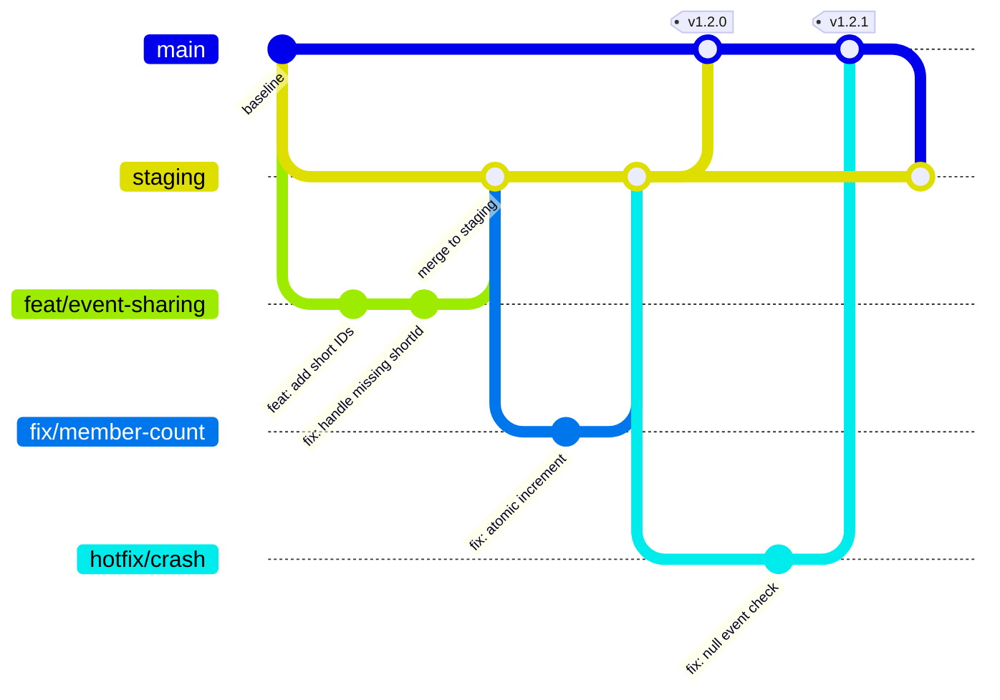
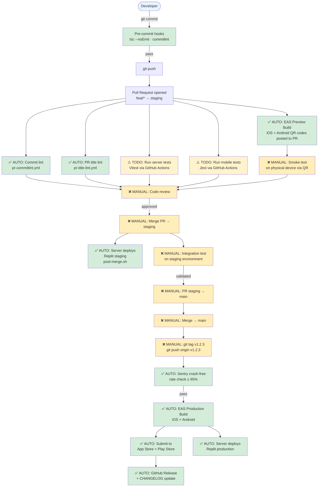
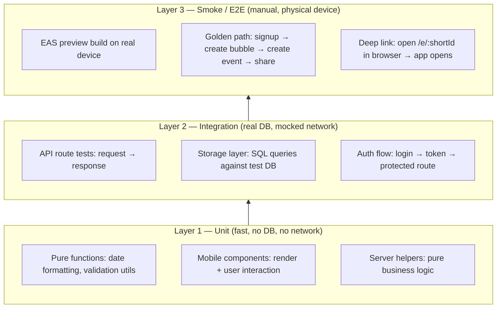
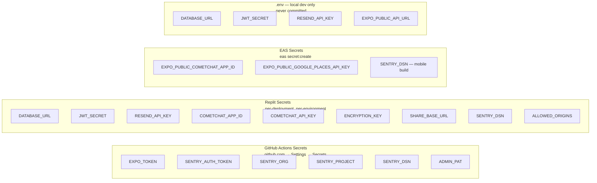

# Testing & Deployment Playbook

## Quick Reference: Automated vs Manual

| What | Automated | Tool |
|---|---|---|
| Type-check on commit | ✅ | Husky + lint-staged |
| Commit message format | ✅ | Husky + commitlint |
| PR title format | ✅ | GitHub Actions |
| Preview iOS/Android build on every PR | ✅ | GitHub Actions + EAS |
| Server unit tests on every PR | ✅ | GitHub Actions + Vitest (`ci.yml`) |
| API E2E tests on every PR | ✅ | GitHub Actions + Playwright (`ci.yml`) |
| Mobile unit tests on every PR | ✅ | GitHub Actions + Jest (`ci.yml`) |
| Staging E2E after merge to staging | ✅ | GitHub Actions + Playwright (`staging-e2e.yml`) |
| Pre-release production health check | ✅ (manual trigger) | GitHub Actions + Playwright (`pre-release.yml`) |
| Production build + App Store submit | ✅ (triggered by git tag) | GitHub Actions + EAS |
| GitHub release + CHANGELOG | ✅ | GitHub Actions |
| Server deploy to Replit | ✅ (post-merge hook) | Replit |
| Code review | ❌ Manual | GitHub PR |
| Merge PR | ❌ Manual | GitHub PR |
| Create release git tag | ❌ Manual | Terminal |
| Test on physical device (preview build) | ❌ Manual | EAS preview QR |
| Sentry crash rate check before release | ✅ (gated in workflow) | eas-build.yml |
| Rotate secrets | ❌ Manual | Replit / GitHub Secrets |
| Fill APPLE_TEAM_ID / SHA256 fingerprint | ❌ Manual | developer.apple.com / EAS |

---

## 1. Branching Strategy



### Rules

- **`main`** — production-ready only. Protected: no direct pushes, PRs required, status checks must pass.
- **`staging`** — integration branch. All feature PRs merge here first. Server auto-deploys to Replit staging on merge.
- **`feat/*`, `fix/*`, `chore/*`** — short-lived branches off `staging`. Deleted after merge.
- **Hotfixes** — branch from `main`, PR directly to `main`, then backport to `staging` with a second PR.
- **Release** — after `staging` is validated, open a PR from `staging` → `main`, merge, then tag.

### Git Operations (what you do from the terminal)

```bash
# Start a feature
git checkout staging && git pull
git checkout -b feat/my-feature

# Push and open PR → staging
git push -u origin feat/my-feature

# Release: after staging PR is merged to main
git checkout main && git pull
git tag v1.2.3
git push origin v1.2.3        # triggers production EAS build automatically
```

---

## 2. CI/CD Pipeline



**Green = already automated. Yellow = manual step. Orange = wired but not yet done.**

---

## 3. Testing Plan

### Testing Layers



### Server Tests (Vitest) — `server/__tests__/`

**Already exists:**

| File | What it covers |
|---|---|
| `auth.test.ts` | Login, signup, JWT tokens |
| `send-verification.test.ts` | Email verification send |
| `verify-code.test.ts` | Code validation + rate limiting |
| `campus-send-verification.test.ts` | Campus email verification |
| `campus-verify-code.test.ts` | Campus code validation |
| `campus-dismiss-prompt.test.ts` | Campus prompt dismissal |
| `sentry.test.ts` | Error tracking + slow response reporting |
| `slowCallConfig.test.ts` | Slow call threshold config |
| `users-me.test.ts` | Profile update endpoint |
| `reports.test.ts` | Report submission |
| `crash-report.test.ts` | Crash report collection |

**Needs to be added:**

| File | What to test |
|---|---|
| `bubbles.test.ts` | Create, join, leave, member count atomic increment, short ID generation |
| `events.test.ts` | Create, RSVP, short ID generation, `GET /api/events/short/:shortId` |
| `notifications.test.ts` | Unread count, mark read, push token register/unregister |
| `bulletin.test.ts` | Post create, reply, pin, reaction |
| `admin.test.ts` | Bubble/event approve/reject, maintenance mode toggle |
| `deep-links.test.ts` | `GET /b/:shortId` and `GET /e/:shortId` redirect/JSON responses |

**Run command:**
```bash
npx vitest run                    # all tests once
npx vitest                        # watch mode during development
npx vitest run --coverage         # with coverage report
```

---

### Mobile Tests (Jest) — `mobile/src/`

**Already exists:**

| File | What it covers |
|---|---|
| `context/__tests__/AuthContext.test.tsx` | Super admin role, logout, Sentry user tracking |
| `utils/__tests__/crashReporter.test.ts` | Crash reporting + Sentry integration |

**Needs to be added:**

| File | What to test |
|---|---|
| `navigation/__tests__/RootNavigator.test.tsx` | Deep link parsing: `/b/:id` → BubbleDetails, `/e/:id` → EventDetails |
| `screens/auth/__tests__/LoginScreen.test.tsx` | Form validation, error states, submit |
| `screens/auth/__tests__/SignupScreen.test.tsx` | Field validation, verification flow |
| `screens/main/__tests__/EventDetailsScreen.test.tsx` | Share button builds correct URL, handles missing shortId |
| `services/__tests__/api.service.test.ts` | Request formation, auth headers, error handling |
| `utils/__tests__/formatting.test.ts` | Date/time formatting, member count display |

**Run command:**
```bash
cd mobile && npm test             # run all tests
cd mobile && npm test -- --watch  # watch mode
```

---

### Analytics Dashboard Tests (Vitest or Jest) — `app/`

**Currently: zero tests.**

**Needs to be added:**

| File | What to test |
|---|---|
| `app/src/__tests__/App.test.tsx` | Renders metrics, handles loading state, handles API error |
| `app/src/__tests__/charts.test.tsx` | Retention/DAU/MAU chart data transforms |

---

### CI Workflows (implemented)

Three workflow files exist in `.github/workflows/`:

| File | Trigger | What it runs |
|---|---|---|
| `ci.yml` | Every PR to `main` or `staging` | Type check + Vitest + Jest + Playwright E2E against ephemeral Postgres |
| `staging-e2e.yml` | Push to `staging` branch | Playwright E2E against live Replit staging server |
| `pre-release.yml` | Manual dispatch (type "yes" to confirm) | Read-only `@prod-safe` health checks against production |

The `ci.yml` workflow spins up a fresh Postgres 16 container, starts the Express server against it, runs all three test suites, and uploads a Playwright HTML report as a downloadable artifact on failure.

---

## 4. Secrets Management

### The Problem Right Now

`.env` containing `JWT_SECRET=47bcf839...` is committed to git. **This secret is compromised.** It must be rotated before going to production.

### Fix `.env` in git

```bash
# Untrack the file (keeps it on disk, removes from git)
git rm --cached .env
git commit -m "chore: untrack .env file"
git push
```

Then generate a new JWT secret:
```bash
node -e "console.log(require('crypto').randomBytes(32).toString('hex'))"
```

---

### Secrets Inventory



### Full Secrets Table

| Variable | Used By | Where to Store | Notes |
|---|---|---|---|
| `JWT_SECRET` | Server auth | Replit Secrets | **Rotate now — was committed to git** |
| `DATABASE_URL` | Server DB | Replit Secrets | Different URL per environment |
| `RESEND_API_KEY` | Server email | Replit Secrets | From resend.com dashboard |
| `ENCRYPTION_KEY` | Server email encrypt | Replit Secrets | 32-byte hex key |
| `COMETCHAT_APP_ID` | Server + mobile | Replit Secrets + EAS | Same value, two places |
| `COMETCHAT_API_KEY` | Server only | Replit Secrets | Never in mobile |
| `SENTRY_DSN` | Server + mobile + CI | Replit Secrets + EAS + GitHub | Public-safe but keep centralized |
| `SHARE_BASE_URL` | Server | Replit Secrets | `https://trybubble.io` in production |
| `ALLOWED_ORIGINS` | Server CORS | Replit Secrets | Comma-separated list |
| `EXPO_PUBLIC_API_URL` | Mobile dev | `.env` local only | Set per dev machine |
| `EXPO_PUBLIC_COMETCHAT_APP_ID` | Mobile build | EAS Secrets | Injected at build time |
| `EXPO_PUBLIC_GOOGLE_PLACES_API_KEY` | Mobile build | EAS Secrets | Restrict to bundle ID in Google Console |
| `EXPO_TOKEN` | CI builds | GitHub Actions Secret | From expo.dev account settings |
| `SENTRY_AUTH_TOKEN` | CI + Sentry upload | GitHub Actions Secret | From sentry.io API settings |
| `SENTRY_ORG` | CI | GitHub Actions Secret | Sentry org slug |
| `SENTRY_PROJECT` | CI | GitHub Actions Secret | Sentry project slug |
| `ADMIN_PAT` | Branch protection | GitHub Actions Secret | GitHub personal access token |
| `APPLE_TEAM_ID` | AASA file (deep links) | Replit Secrets | From developer.apple.com → Membership |
| `ANDROID_SHA256_FINGERPRINT` | assetlinks.json | Replit Secrets | From `eas credentials --platform android` |
| `STAGING_URL` | `staging-e2e.yml` | GitHub Actions Secret | Full URL of Replit staging deployment, e.g. `https://staging.trybubble.io` |
| `PRODUCTION_URL` | `pre-release.yml` | GitHub Actions Secret | Full URL of production deployment, e.g. `https://trybubble.io` |
| `TEST_DATABASE_URL` | Local E2E runs | Local `.env` only | Postgres URL for your local E2E test database — never committed |

### How to Add a Secret

**Replit:**  
Replit sidebar → Secrets → + New secret

**GitHub Actions:**  
github.com → repo → Settings → Secrets and variables → Actions → New repository secret

**EAS (build-time mobile secrets):**
```bash
cd mobile
eas secret:create --scope project --name EXPO_PUBLIC_GOOGLE_PLACES_API_KEY --value "your-key"
eas secret:list   # verify
```

### Secret Rotation Process (manual)

1. Generate new value
2. Update in Replit Secrets for the affected environment
3. Restart the Replit deployment (for server secrets)
4. For EAS secrets: `eas secret:push` then trigger a new build
5. For GitHub Actions: update via repo Settings, no restart needed

---

## 5. Deployment Reference

### Server (Replit — fully automated post-merge)

```
git push → post-merge.sh runs → npm run build → node dist/index.cjs
autoMigrate() runs on startup (safe: IF NOT EXISTS SQL)
```

No manual steps. Staging and production are separate Replit deployments with separate secrets.

### Mobile (EAS — triggered by git tag)

```
git tag v1.2.3
git push origin v1.2.3
         ↓
eas-build.yml triggers
  → Sentry crash-free rate check (≥ 95% required)
  → EAS builds iOS + Android production
  → Auto-submits to App Store + Play Store
  → Creates GitHub release + updates CHANGELOG.md
```

Manual step: only the `git tag` command. Everything after is automated.

### Webapp / Analytics Dashboard

Currently served as part of the main server (static files). No separate deployment needed — it redeploys with the server.

---

## 6. Immediate Action Items

| Priority | Action | Tool | Who |
|---|---|---|---|
| 🔴 Critical | Remove `.env` from git, rotate `JWT_SECRET` | Terminal + Replit | Dev |
| 🔴 Critical | Set `APPLE_TEAM_ID` in Replit Secrets → enables iOS deep links | developer.apple.com | Dev |
| 🔴 Critical | Set `ANDROID_SHA256_FINGERPRINT` in Replit Secrets → enables Android deep links | `eas credentials` | Dev |
| 🔴 Critical | Add `STAGING_URL` to GitHub Actions Secrets | GitHub repo settings | Dev |
| 🔴 Critical | Add `PRODUCTION_URL` to GitHub Actions Secrets | GitHub repo settings | Dev |
| 🟠 High | Create `staging` branch, set as PR default target | GitHub branch settings | Dev |
| 🟡 Medium | Add server tests: bubbles, events, notifications, bulletin | Code | Dev |
| 🟡 Medium | Add mobile tests: RootNavigator deep links, EventDetails share | Code | Dev |
| 🟡 Medium | Add FK indexes to `auto-migrate.ts` (memberships, events, notifications) | Code | Dev |
| 🟢 Low | Add webapp tests: App.tsx renders, chart data transforms | Code | Dev |
| 🟢 Low | Add `eas secret:create` for Google Places + CometChat keys | EAS CLI | Dev |
| ✅ Done | Wire unit tests + E2E to CI (`ci.yml`) | GitHub Actions | Done |
| ✅ Done | Add Playwright E2E tests (health, auth, admin, deep-links, rate-limit) | Code | Done |
| ✅ Done | Add staging + pre-release workflows | GitHub Actions | Done |

---

## 7. Running Tests

### Prerequisites

Install dependencies and set up a local test database:

```bash
# From the project root
npm ci

# Create a local Postgres database for E2E tests
# (separate from your dev database — E2E tests write real data)
createdb bubble_test
```

Add to your local `.env` (not committed):
```
TEST_DATABASE_URL=postgresql://localhost/bubble_test
```

---

### Unit Tests (Vitest — server)

Tests in `server/__tests__/*.test.ts`. Use mocked storage — no database needed.

```bash
# Run once
npm test

# Watch mode during development
npm run test:watch

# With coverage report
npx vitest run --coverage
```

---

### Unit Tests (Jest — mobile)

Tests in `mobile/src/**/__tests__/*.test.tsx`.

```bash
cd mobile

# Run once
npm test

# Watch mode
npm test -- --watch

# Run a specific file
npm test -- AuthContext
```

---

### API E2E Tests (Playwright)

Tests in `server/__tests__/e2e/*.e2e.ts`. Starts a real Express server and a real Postgres database. Uses `george@seinfeld.com` (created by the startup seed) as the admin account.

```bash
# Run all E2E tests locally
TEST_DATABASE_URL=postgresql://localhost/bubble_test npm run test:e2e

# Run a single test file
TEST_DATABASE_URL=postgresql://localhost/bubble_test npx playwright test server/__tests__/e2e/auth.e2e.ts

# Run only tests tagged @prod-safe (read-only, safe to run against staging/prod)
TEST_DATABASE_URL=postgresql://localhost/bubble_test npm run test:e2e:prod

# Open the HTML report after a run
npm run test:e2e:report

# Run against staging instead of local server
E2E_BASE_URL=https://staging.trybubble.io npx playwright test
```

**What happens on `npm run test:e2e`:**
1. Playwright reads `playwright.config.ts`
2. Starts `npx tsx server/index.ts` with `NODE_ENV=test` and `TEST_DATABASE_URL`
3. Waits for `/api/v1/ping` to respond (up to 40 seconds)
4. `global-setup.ts` runs: logs in as `george@seinfeld.com`, creates test user + bubble + event, writes tokens to `.test-context.json`
5. All `*.e2e.ts` files run sequentially
6. `global-teardown.ts` deletes `.test-context.json`

**If the server fails to start**, check:
- `TEST_DATABASE_URL` is set and points to a running Postgres instance
- Port 5000 is not already in use (`lsof -i :5000`)

---

### Pre-release Production Check

Run this manually before tagging a release. Only hits read-only endpoints — no writes to the production database.

```bash
# From terminal (triggers the GitHub Actions workflow)
gh workflow run pre-release.yml -f confirm=yes

# Or run locally against production
E2E_BASE_URL=https://trybubble.io npm run test:e2e:prod
```

---

## 8. Secret Setup Guide

### GitHub Actions Secrets

Navigate to: **github.com → repo → Settings → Secrets and variables → Actions → New repository secret**

| Secret name | Where to get it | Required for |
|---|---|---|
| `EXPO_TOKEN` | expo.dev → Account Settings → Access Tokens | All EAS build workflows |
| `SENTRY_AUTH_TOKEN` | sentry.io → Settings → Auth Tokens | EAS build (source maps upload) |
| `SENTRY_ORG` | Your Sentry organization slug | EAS build |
| `SENTRY_PROJECT` | Your Sentry project slug | EAS build |
| `SENTRY_DSN` | sentry.io → Project → Settings → Client Keys | EAS build + preview |
| `ADMIN_PAT` | github.com → Settings → Developer Settings → Personal access tokens | Branch protection workflow |
| `STAGING_URL` | Your Replit staging deployment URL, e.g. `https://staging.trybubble.io` | `staging-e2e.yml` |
| `PRODUCTION_URL` | `https://trybubble.io` | `pre-release.yml` |

---

### Replit Secrets

Navigate to: **Replit sidebar → Secrets → + New secret** (set separately for each deployment — staging and production)

| Secret name | Where to get it | Notes |
|---|---|---|
| `JWT_SECRET` | Generate: `node -e "console.log(require('crypto').randomBytes(32).toString('hex'))"` | **Must rotate** — previous value was committed to git |
| `DATABASE_URL` | Replit PostgreSQL connection string | Different per environment |
| `RESEND_API_KEY` | resend.com → API Keys | For sending verification emails |
| `ENCRYPTION_KEY` | Generate 32-byte hex: `node -e "console.log(require('crypto').randomBytes(32).toString('hex'))"` | For email encryption |
| `COMETCHAT_APP_ID` | CometChat dashboard → Apps | Same value as mobile |
| `COMETCHAT_API_KEY` | CometChat dashboard → Apps → API Keys | Server only, never in mobile |
| `SENTRY_DSN` | sentry.io → Project → Settings → Client Keys | Same value as GitHub secret |
| `SHARE_BASE_URL` | `https://trybubble.io` (production) or staging URL | Used in share link HTML |
| `ALLOWED_ORIGINS` | Comma-separated list: `https://trybubble.io,https://staging.trybubble.io` | CORS |
| `APPLE_TEAM_ID` | developer.apple.com → Account → Membership → Team ID | AASA file for iOS Universal Links |
| `ANDROID_SHA256_FINGERPRINT` | Run: `cd mobile && eas credentials --platform android` | assetlinks.json for Android App Links |

---

### EAS Secrets (build-time mobile values)

Run from the `mobile/` directory. These are injected at build time and are safe to use for `EXPO_PUBLIC_*` variables.

```bash
cd mobile

# Set each secret
eas secret:create --scope project --name EXPO_PUBLIC_COMETCHAT_APP_ID --value "your-app-id"
eas secret:create --scope project --name EXPO_PUBLIC_GOOGLE_PLACES_API_KEY --value "your-key"
eas secret:create --scope project --name SENTRY_DSN --value "your-dsn"

# Verify
eas secret:list
```

---

### Generating Secrets

```bash
# JWT_SECRET and ENCRYPTION_KEY (32 random bytes as hex)
node -e "console.log(require('crypto').randomBytes(32).toString('hex'))"

# Android SHA-256 fingerprint (run from mobile/ directory)
eas credentials --platform android

# Apple Team ID
# → developer.apple.com → top-right account menu → Membership → Team ID
```
