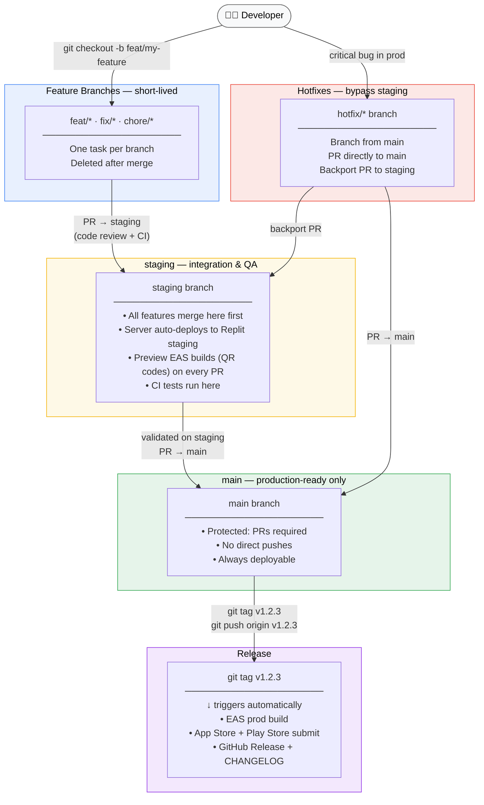
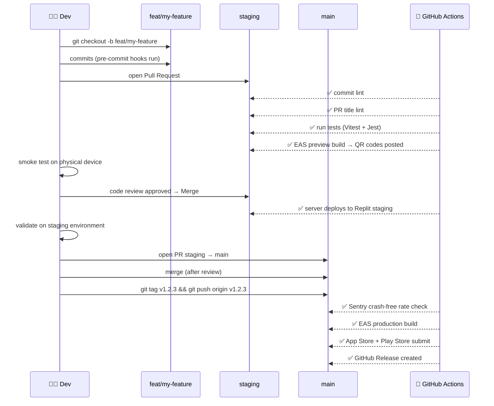
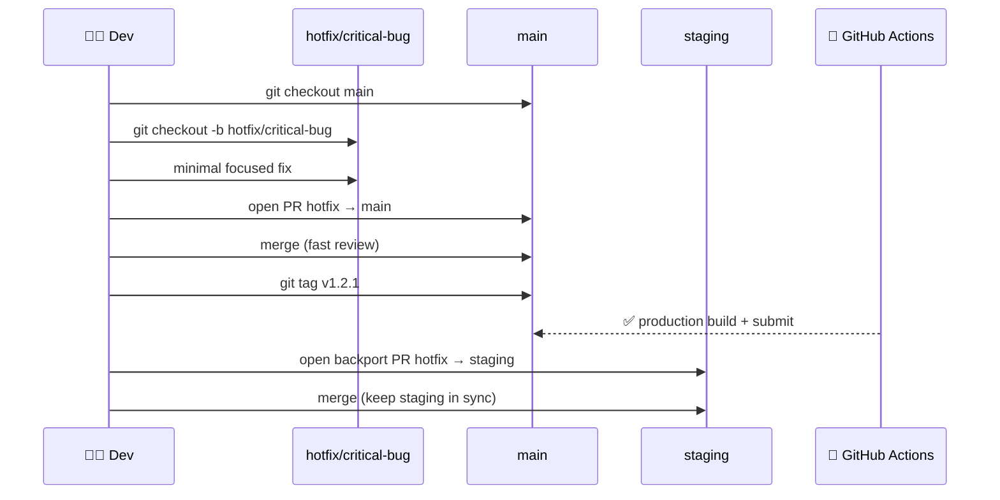

# Branching Strategy



---

## Branch Lifecycle



---

## Hotfix Lifecycle



---

## Naming Conventions

| Branch | Pattern | Example |
|---|---|---|
| Feature | `feat/<short-description>` | `feat/event-share-links` |
| Bug fix | `fix/<short-description>` | `fix/member-count-race` |
| Chore / infra | `chore/<short-description>` | `chore/add-ci-workflow` |
| Hotfix | `hotfix/<short-description>` | `hotfix/null-event-crash` |
| Release tag | `v<major>.<minor>.<patch>` | `v1.2.3` |

Commit messages must follow **Conventional Commits** (enforced by Husky):
```
feat: add event share deep links
fix: atomic member count increment
chore: untrack .env file
```
