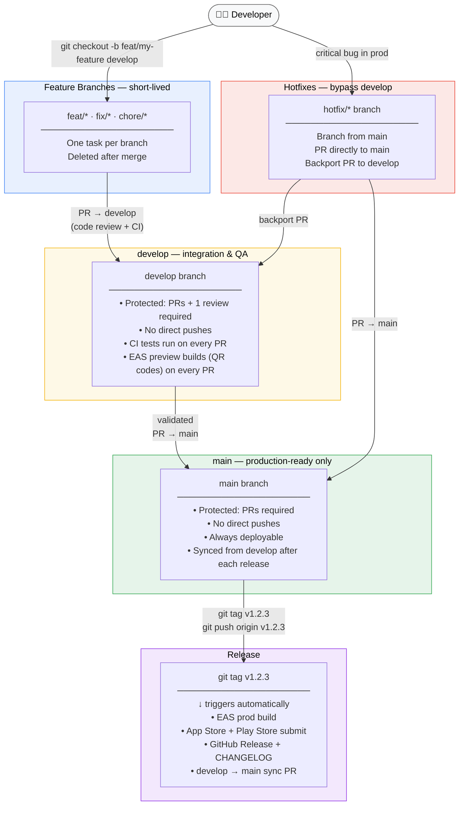
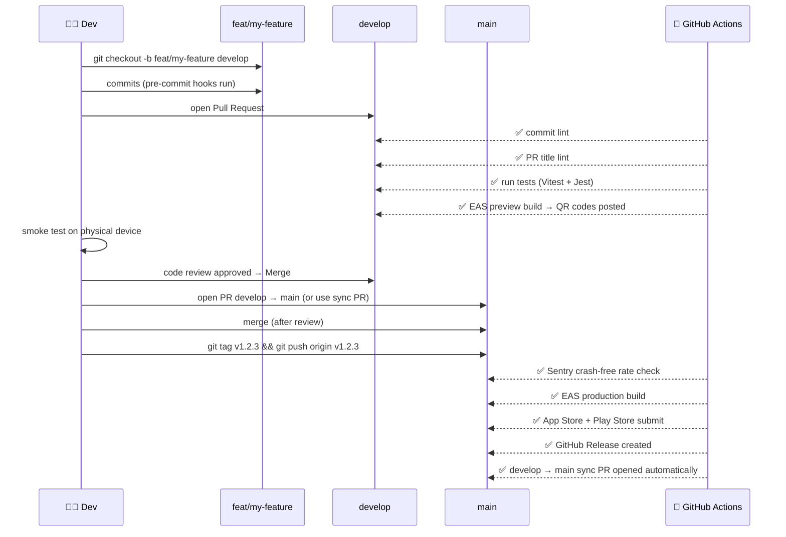
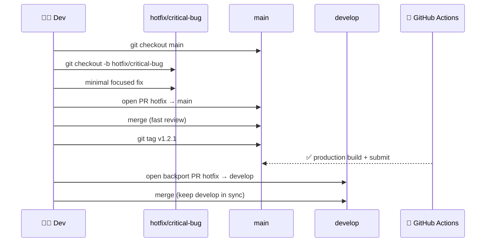

# Branching Strategy

## Branches at a glance

| Branch | Purpose | Who pushes |
|--------|---------|------------|
| `main` | Production-ready; triggers App Store + Play Store deploys on tag | Automated sync PR from `develop`; hotfix PRs |
| `develop` | Integration branch; all feature work lands here — **protected: PRs + CI required** | Feature PRs from contributors |
| `feat/*`, `fix/*`, `chore/*` | Short-lived work branches | Individual contributors |
| `hotfix/*` | Critical production fixes | On-call engineer — branches from `main` |

---

## Day-to-day flow


```mermaid
flowchart TD
    DEV(["👩‍💻 Developer"])

    DEV -->|"git checkout -b feat/my-feature develop"| FB

    subgraph FEATURE["Feature Branches  —  short-lived"]
        FB["feat/* · fix/* · chore/*\n─────────────────────\nOne task per branch\nDeleted after merge"]
    end

    subgraph DEV_ENV["develop  —  integration & QA"]
        DEVEL["develop branch\n─────────────────────\n• Protected: PRs + 1 review required\n• No direct pushes\n• CI tests run on every PR\n• EAS preview builds (QR codes) on every PR"]
    end

    subgraph MAIN_ENV["main  —  production-ready only"]
        MAIN["main branch\n─────────────────────\n• Protected: PRs required\n• No direct pushes\n• Always deployable\n• Synced from develop after each release"]
    end

    subgraph HOTFIX_ENV["Hotfixes  —  bypass develop"]
        HF["hotfix/* branch\n─────────────────────\nBranch from main\nPR directly to main\nBackport PR to develop"]
    end

    subgraph RELEASE["Release"]
        TAG["git tag v1.2.3\n─────────────────────\n↓ triggers automatically\n• EAS prod build\n• App Store + Play Store submit\n• GitHub Release + CHANGELOG\n• develop → main sync PR"]
    end

    FB -->|"PR → develop\n(code review + CI)"| DEVEL
    DEVEL -->|"validated\nPR → main"| MAIN
    MAIN -->|"git tag v1.2.3\ngit push origin v1.2.3"| TAG

    DEV -->|"critical bug in prod"| HF
    HF -->|"PR → main"| MAIN
    HF -->|"backport PR"| DEVEL

    style FEATURE fill:#e8f0fe,stroke:#4285f4,color:#000
    style DEV_ENV fill:#fef9e7,stroke:#f4b400,color:#000
    style MAIN_ENV fill:#e6f4ea,stroke:#34a853,color:#000
    style HOTFIX_ENV fill:#fce8e6,stroke:#ea4335,color:#000
    style RELEASE fill:#f3e8fd,stroke:#9334e6,color:#000
    style DEV fill:#f8f9fa,stroke:#666,color:#000
```

---

## Keeping main and develop in sync

**Why it matters:** if `main` drifts too far behind `develop`, future merges produce
large conflicts that require manual resolution. After the `UpcomingScreen.tsx` conflict
(57-commit gap), we automated this.

**Cadence:** after every successful production EAS build, a GitHub Action
(`.github/workflows/sync-develop-to-main.yml`) automatically opens a
**`develop → main` sync PR**. The PR is idempotent — if one already exists, no
duplicate is created.

**Manual trigger:** you can also open the sync PR at any time from
**GitHub → Actions → Sync develop → main → Run workflow**.

**What to do when the PR appears:**
1. Review the diff — confirm only expected changes are included.
2. If there are conflicts, resolve them in a local branch and push to the PR.
3. Approve and merge with **Merge commit** (not squash) to preserve history.

The goal is to keep `main` within a few commits of `develop` at all times.

---

## Release lifecycle


```mermaid
sequenceDiagram
    participant D as 👩‍💻 Dev
    participant F as feat/my-feature
    participant DV as develop
    participant M as main
    participant CI as 🤖 GitHub Actions

    D->>F: git checkout -b feat/my-feature develop
    D->>F: commits (pre-commit hooks run)
    D->>DV: open Pull Request
    CI-->>DV: ✅ commit lint
    CI-->>DV: ✅ PR title lint
    CI-->>DV: ✅ run tests (Vitest + Jest)
    CI-->>DV: ✅ EAS preview build → QR codes posted
    D->>D: smoke test on physical device
    D->>DV: code review approved → Merge
    D->>M: open PR develop → main (or use sync PR)
    D->>M: merge (after review)
    D->>M: git tag v1.2.3 && git push origin v1.2.3
    CI-->>M: ✅ Sentry crash-free rate check
    CI-->>M: ✅ EAS production build
    CI-->>M: ✅ App Store + Play Store submit
    CI-->>M: ✅ GitHub Release created
    CI-->>M: ✅ develop → main sync PR opened automatically
```

---

## Hotfix lifecycle


```mermaid
sequenceDiagram
    participant D as 👩‍💻 Dev
    participant H as hotfix/critical-bug
    participant M as main
    participant DV as develop
    participant CI as 🤖 GitHub Actions

    D->>M: git checkout main
    D->>H: git checkout -b hotfix/critical-bug
    D->>H: minimal focused fix
    D->>M: open PR hotfix → main
    D->>M: merge (fast review)
    D->>M: git tag v1.2.1
    CI-->>M: ✅ production build + submit
    D->>DV: open backport PR hotfix → develop
    D->>DV: merge (keep develop in sync)
```

---

## Naming conventions

| Branch | Pattern | Example |
|--------|---------|---------|
| Feature | `feat/<short-description>` | `feat/event-share-links` |
| Bug fix | `fix/<short-description>` | `fix/member-count-race` |
| Chore / infra | `chore/<short-description>` | `chore/add-ci-workflow` |
| Hotfix | `hotfix/<short-description>` | `hotfix/null-event-crash` |
| Release tag | `v<major>.<minor>.<patch>` | `v1.2.3` |

Commit messages must follow **Conventional Commits** (enforced by Husky):
```
feat: add event share deep links
fix: atomic member count increment
chore: untrack .env file
```

---

## FAQ

**Which branch do I branch off from for new features?**  
Always branch from `develop`, not `main`.

**When does `main` get updated?**  
- After a release: the automated sync PR lands `develop` changes into `main`.
- For hotfixes: directly via a `hotfix/*` PR.

**Can I push directly to `main` or `develop`?**  
No. Both branches are protected — all changes go through PRs.

**What if the sync PR has conflicts?**  
Checkout a local branch from `main`, merge `develop` into it, resolve conflicts, then push
to the sync PR branch. The conflicts are usually isolated to files that were changed in
both branches since the last sync.
