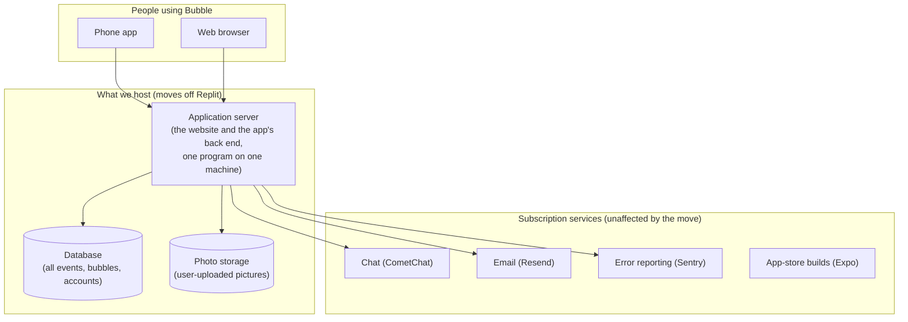
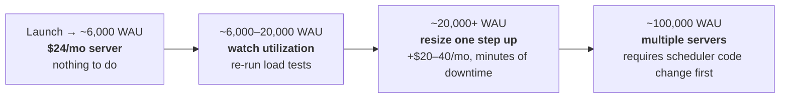
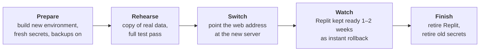
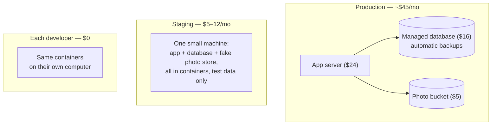

# Moving Bubble off Replit

*Prepared for team discussion. Research completed 2026-07-03; rewritten for a general audience 2026-07-18. This is a research report — no application code has been changed. The supporting documents listed at the end contain the technical detail behind every number here.*

---

## The short version

**We can move Bubble off Replit, the move is technically straightforward, and the ongoing cost is modest and predictable.** The headline conclusions:

1. **Everything Bubble needs can run on ordinary cloud hosting.** The application is not tied to Replit in any deep way. There is exactly one piece of Replit-specific plumbing (the photo-storage connection), and it has three known workarounds, including one small code change we recommend.

2. **The whole application fits comfortably on one small server.** We measured this rather than guessing: even our most aggressive growth scenario uses only about a tenth of what one small ($24/month) server can handle. We do not need a fleet of machines, load balancers, or auto-scaling for any usage level we can realistically forecast.

3. **Expect roughly $45–65 per month.** Akamai/Linode is the least expensive suitable vendor at about $45/month for server, managed database, and photo storage. Comparable setups run $51–83/month at Microsoft, Amazon, and Google, and about $142/month at IBM. Usage growth barely changes these bills — with one exception, photo bandwidth, discussed below.

4. **The strongest argument for moving is data safety, not price.** Replit lost our database once and recovery took days. Every serious hosting vendor offers managed databases with automatic daily backups and point-in-time recovery. We recommend weighting backup quality as heavily as price in the final vendor decision.

5. **Recommended shape:** one Linode server running the application, Linode's managed PostgreSQL database, and a storage bucket for user photos — approximately **$45/month**, essentially flat from launch through thousands of weekly users.

The rest of this document explains what the application actually needs, what usage levels would change the picture, what the move would look like, and what security and testing work should happen first. Deep technical detail lives in the appendices and the companion documents.

---

## Why we are considering this

Two things prompted the research:

- **Cost uncertainty.** We did not have a clear picture of what Replit will cost us as usage grows, or how that compares to conventional hosting.
- **The database-loss incident.** Replit lost our production database, and restoring from backup took multiple days. That is not an acceptable recovery story for a product with real users.

---

## What Bubble actually needs to run

Stripped to essentials, Bubble's production footprint is three things we host, plus several subscription services that stay exactly as they are today no matter where we host.

A few points worth understanding, because they drive every decision that follows:

**The application server must run continuously.** Besides answering requests, it runs internal scheduled chores — sending event reminders, cleaning up old data, watching for crash spikes. Because of how those chores are built today, the application is designed to run as **exactly one copy, always on**. This rules out "pay only when someone visits" hosting styles, and it means running several copies behind a load balancer would need a code change first. Neither limitation matters at our scale (see the next section), but they shape the plan.

**The database is small and will stay small.** Even at thousands of weekly users, all of Bubble's data fits in single-digit gigabytes — tiny by database standards. What matters when choosing a database service is not capacity but **backup quality**: automatic daily backups and the ability to restore to a point in time. That is the direct answer to the Replit incident.

**Photo bandwidth is the only cost that grows with usage.** Server and database costs are flat. What grows is the data transferred when users view photos — from a couple of gigabytes a month today to potentially a terabyte a month in the most aggressive scenario. Vendors price this wildly differently, which is the single biggest differentiator between them (details in the cost section).

**One thing we do *not* need to host:** the developer preview tool (called Metro) that currently runs on Replit. It is used only while developers are actively working; released versions of the phone app never contact it. Removing it from the picture simplified the whole plan. (Details: [metro-in-production.md](metro-in-production.md).)

---

## How much usage can the hosting handle?

We defined five usage scenarios with the business team, expressed as daily and weekly active users (DAU / WAU), then **measured** — with real load tests against the packaged application — what each scenario demands of a server. The measurements are in [perf-test-plan.md](perf-test-plan.md); the arithmetic is in [usage-scenarios-to-load-model.md](usage-scenarios-to-load-model.md).

| Scenario | Daily active users | Weekly active users | What the smallest recommended server does with it |
|---|---|---|---|
| Zero growth | 3 | 5 | Idles. Under 5% busy. |
| Low usage | 10 | 25 | Idles. Under 5% busy. |
| Moderate usage | 50 | 100 | Idles. Under 5% busy. |
| Fast growth | 100 | 700 | Barely notices. ~6% busy at peak. |
| "Insane" growth | 1,500 | 6,000 | Comfortable. ~22% busy at the busiest hour, instant responses, zero errors. |

We then pushed the same server far past the insane scenario to find its actual ceiling. It handled **about four times the insane scenario's peak traffic** — still with zero errors and response times under a hundredth of a second — before we stopped the test, and even then it was not saturated.

### At what point would we need bigger hosting?

Working from those measurements:

- **Up to roughly 6,000 weekly active users** (the full insane scenario): the smallest recommended server (2 CPUs, 4 GB memory, ~$24/month) is comfortable, with about 4× headroom to spare. **No change needed.**
- **Roughly 6,000–20,000 weekly active users:** the same server should still cope — our stress test proved capacity in this range — but this is where we would start watching the server's busy-hour utilization and re-verifying with fresh measurements. Somewhere around **15,000–25,000 WAU** is the honest trigger point to **move up one server size**. That is a resize, not a redesign: a few minutes of planned downtime and roughly **$20–40/month more**.
- **Approaching 100,000 weekly active users:** at this point a single machine stops being the right answer and we would want **several servers sharing the load** — which is what "auto-scaling" actually means in practice.

### When would we need auto-scaling?

**Not at any usage level in our current planning horizon — and it is not something we can simply switch on.** Two facts:

1. There is no *capacity* need for it below very large usage (~100,000 WAU territory, roughly 15× our most aggressive scenario). Below that, moving up server sizes is simpler, cheaper, and entirely sufficient.
2. It is *blocked by a code change* regardless. Because the application's internal scheduled chores assume exactly one running copy, running two copies today would send users duplicate reminders. Before any multi-server setup, developers must add coordination so only one copy runs the chores ("leader election" — a well-understood, moderately sized piece of work).

**Practical takeaway:** plan on the single-server path with size upgrades as needed. Treat auto-scaling as a future project triggered by extraordinary success, and schedule the enabling code change only when growth genuinely approaches the need.

---

## What it costs

Estimated monthly bills for the minimal always-on setup (server + managed database + 50 GB of photo storage), by vendor and scenario. These come from a pricing model fed with the measured traffic numbers; sources and caveats are in [hosting-pricing-parameters.md](hosting-pricing-parameters.md) and [hosting-cost-estimates.md](hosting-cost-estimates.md).

| Scenario | Linode | Azure (Microsoft) | AWS (Amazon) | Vultr | GCP (Google) | IBM Cloud |
|---|---|---|---|---|---|---|
| Zero growth → fast growth | **$45** | $51 | $55 | $60 | $83 | $142–147 |
| Insane growth | **$45** | $120 | $126 | $60 | $166 | $222 |

Three things to take from this table:

1. **Until usage is very large, the vendors differ only in their floor price**, because the workload is small everywhere. Linode is cheapest at ~$45/month.
2. **Only the insane scenario separates vendors, and the entire difference is photo bandwidth.** The big three (Amazon, Microsoft, Google) charge roughly 9–12 cents per gigabyte transferred; at a terabyte a month that adds ~$70–85. Linode and Vultr include multi-terabyte transfer allowances with the server, so their bills stay flat. Cloudflare's R2 storage charges nothing at all for transfer and can be bolted onto any vendor's setup as a photo store — worth keeping in mind as a growth-insurance option.
3. **IBM is not competitive for this workload** and can be dropped from consideration.

For comparison during the discussion, Replit's current charges (reserved machine + database + storage) should be placed alongside these numbers as the negotiating baseline.

**One caution that protects these estimates:** the application currently serves its built-in category images inefficiently — 124 MB of oversized files that phones are forced to re-download over and over. On Linode this hides inside the transfer allowance; on a big-three vendor it would add real dollars at scale, and either way it makes screens slow and causes the known "icons disappear offline" bug. Two small fixes (compress the images, tell phones to cache them) shrink the problem to nearly nothing and should ride along with the migration. Details: [image-costs-and-caching.md](image-costs-and-caching.md).

---

## How trustworthy are these numbers, and what would proper performance testing take?

The load tests behind this report ran on a developer laptop against the packaged application — real application, real database, simulated users. That is excellent for *sizing* ("does a small server cope?" — emphatically yes) but a laptop is not a cloud server, so the numbers should be treated as strong guidance rather than guarantees.

**Proper performance testing — the checklist before final commitment:**

1. **Repeat the tests on the actual candidate server** at the chosen vendor, not a laptop. (A weekend and under $10 of hourly server rental covers this; a step-by-step guide exists: [How-to-test-on-Linode.md](How-to-test-on-Linode.md).)
2. **Include photo and image traffic.** The laptop tests measured the application's data responses precisely but *modeled* photo downloads from assumptions. Photos are the one growing cost, so they deserve direct measurement.
3. **Test from the outside world**, so response times include real internet distance, not just a laptop talking to itself.
4. **Run at least one long soak test** (hours, not ten minutes) to catch slow problems like memory creep.
5. **Rehearse a database restore from backup** and time it. Given the Replit incident, restore speed is a first-class requirement, not an afterthought.
6. One operational footnote for whoever runs the tests: the application deliberately limits login attempts per minute, which trips up load-testing tools unless a test setting is adjusted. This is documented in the test plan.

---

## What security does the first non-Replit deployment need?

Replit quietly handled several safety concerns for us; on our own server they become our responsibility. The following list is the *initial* bar — appropriate for our size, all standard practice, and none of it expensive or exotic. (Technical specifics: [dockerization-plan.md](dockerization-plan.md), sections 5–6.)

1. **A firewall from day one.** Only the public web doors (the standard web ports) are open to the world. Administrative access is restricted. Linode's firewall service is free.
2. **The database is never on the public internet.** It is reachable only from the application server over a private connection. Nobody can even attempt to connect from outside.
3. **Encrypted traffic (HTTPS) everywhere,** with certificates that renew themselves — free and automatic with the recommended setup.
4. **Administrative access by key only.** Password logins disabled; automated break-in attempts blocked.
5. **All secret credentials get replaced during the move.** Several of the application's secrets currently sit in Replit's shared configuration where every Replit collaborator can see them. Migration is the moment to issue fresh secrets and store them properly on the new host. (This should happen even if we stay on Replit.)
6. **Production mode, verified.** An older version of the application had a flaw where a server accidentally left in "developer mode" could be crashed by a single malformed request. The fix is in our code; the migration checklist includes verifying the deployed release has it and that the new server runs in production mode. (This verification is worth doing on today's Replit deployment too — it is an open to-do item regardless of the move.)
7. **Backups with a rehearsed restore.** The managed database's automatic backups, plus one practiced, timed restore drill so recovery is routine rather than an emergency improvisation.
8. **A rollback path during the switch.** Replit stays running for one to two weeks after traffic moves, so we can switch back within minutes if anything goes wrong.

---

## What the move itself looks like

At a high level, the migration is: build the new environment alongside Replit, prove it works with a copy of the data, switch the website address over, and keep Replit as a safety net for two weeks. Users experience no interruption, and **phone users do not need to update their app** — the app finds the server by web address, and the address does not change.

The one genuinely Replit-specific obstacle: the photo-storage code obtains its credentials in a way that only works inside Replit. Three workarounds exist — two require no code changes at all (one was used for all our testing) — and the recommended permanent fix is a small, contained code change (~20 lines in one directory). This is decision item #1 for the team, below.

A hands-on, command-by-command runbook for standing up a complete test deployment on Linode exists at [How-to-move-to-Linode.html](How-to-move-to-Linode.html).

---

## Decisions the team needs to make

1. **The photo-storage fix.** Approve the small code change that frees photo storage from Replit's plumbing (recommended), or operate the no-code-change workaround indefinitely.
2. **Vendor.** Linode is the value recommendation; Azure is the strongest big-three alternative. Replit's real current cost belongs in this comparison.
3. **Managed vs. self-run database.** Managed (recommended) costs ~$16–63/month at Linode and directly answers the backup problem; running it ourselves saves that money but makes us responsible for backups — the exact thing that burned us.
4. **The image fixes** (compress category images, enable caching): do them during the migration, before it, or defer.
5. **Secret replacement plan** — coordinate issuing fresh credentials during cutover.
6. **Verify the developer-mode fix is live** on the current production deployment (open item independent of the move).
7. *(Deferred until growth demands it)* the scheduler code change that would allow multiple application servers.

---

## Appendix A — The detailed inventory, smallest-possible footprints, and environment separation

*This appendix holds the detail deliberately kept out of the main report.*

### A.1 Exactly what gets hosted

| Component | Needed in production? | What it is | How it is hosted in the plan |
|---|---|---|---|
| Application server | Yes — one copy, always on | One program that serves both the website and the phone app's back end | A packaged container on the main server |
| Database (PostgreSQL 16) | Yes | All structured data: accounts, bubbles, events, messages | The vendor's managed database service (recommended), with automatic backups |
| Photo storage | Yes | User-uploaded photos | The vendor's storage-bucket service — never self-hosted |
| Metro (developer preview tool) | **No** | Lets a developer preview app changes live | Runs on developers' own machines; nothing to host or pay for |
| Chat, email, error reporting, app builds | External subscriptions | CometChat, Resend, Sentry, Expo | Unchanged by the move |

The single-copy constraint on the application server, and why it matters, are covered in the main report; the underlying detail (which internal chores create the constraint, and the packaging specifics) is in [dockerization-plan.md](dockerization-plan.md).

### A.2 "What is the minimum we could run on the tiniest host available?"

Smaller than you would guess. Under our heaviest simulated load the application used about 115 MB of memory — the whole stack (application + database together, in containers) runs on Linode's smallest **$5/month** machine (1 CPU, 1 GB memory). That is a legitimate way to run a demo, a staging copy, or a shared development server.

It is **not** the recommendation for production, for reasons of margin rather than fit: the $24/month size buys 4× headroom, room for the operating system's overhead during traffic spikes, and pairs with the managed database (whose backups are the point). The gap between "smallest that works" and "recommended" is $19–40/month — cheap insurance.

### A.3 Separating production, staging, and per-developer environments

| Environment | Purpose | Shape | Approx. monthly cost |
|---|---|---|---|
| **Production** | Real users | $24 server + managed database ($16) + photo bucket ($5) | ~$45 |
| **Staging (pre-production)** | Final testing of releases against a production-like setup | One $5–12 machine running everything in containers, its own test data, its own sub-address (e.g. `staging.…`) | $5–12 |
| **Per-developer** | Day-to-day development | The same containers on each developer's own machine — already built and working; this is exactly how the research testing was done | $0 |
| *(Optional)* shared dev server | A persistent shared playground, if wanted | Same shape as staging | $5–12 |

Three principles worth adopting with this split: staging and production never share a database, storage bucket, or secrets; staging gets manufactured test data, never a copy of real user data (avoids privacy problems); and the entire non-production tier adds at most ~$10–25/month.

### A.4 Fine-grained technical detail

Server operating-system choices, container base images and sizes, the full list of configuration settings and secrets, network topology with private links between hosts, firewall rule listings, and the exact photo-storage workaround mechanics are all in [dockerization-plan.md](dockerization-plan.md) — kept there, at full precision, for whoever performs the migration.

---

## Appendix B — The supporting documents

| Document | What it answers |
|---|---|
| [metro-in-production.md](metro-in-production.md) | Does the developer preview tool need production hosting? (No — and why that's certain.) |
| [usage-scenarios-to-load-model.md](usage-scenarios-to-load-model.md) | How the five usage scenarios translate into concrete traffic and storage numbers. |
| [perf-test-plan.md](perf-test-plan.md) | How the load tests were designed and run, and the full measured results. |
| [hosting-pricing-parameters.md](hosting-pricing-parameters.md) | What each of seven vendors charges for, compared item by item. |
| [hosting-cost-estimates.md](hosting-cost-estimates.md) | The scenario-by-vendor monthly cost table and how it was generated. |
| [dockerization-plan.md](dockerization-plan.md) | How the application is packaged and would be deployed, secured, and switched over. |
| [image-costs-and-caching.md](image-costs-and-caching.md) | The image-serving problem: its cost, the offline-icons bug, and the recommended fixes. |
| [How-to-move-to-Linode.html](How-to-move-to-Linode.html) | Hands-on, command-by-command runbook for a test deployment on Linode. |
| [How-to-test-on-Linode.md](How-to-test-on-Linode.md) | Hands-on guide to performance- and cost-testing that deployment cheaply. |
| [pricing/](pricing/) | One document per vendor (Linode, Vultr, AWS, Azure, Google, IBM, Cloudflare): what Bubble's setup would cost there, the verdict, and the full price detail in an appendix. |

Companion tooling (for developers): the container definitions, build script, load-test scripts, and pricing model live under `scripts/one-off/` (see its README). They are deliberately kept out of the automated test runner's reach, so routine test runs can never trigger them.
