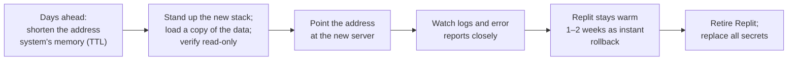

# Packaging and running Bubble outside Replit: the deployment plan

*Part of the [Move-from-Replit](Move-from-Replit.md) research set. Written 2026-07-03. This is research — no application code was changed. The packaging described here was actually built and load-tested; the experiment files live under `scripts/one-off/docker/`.*

## What this document is

If Bubble leaves Replit, something has to define exactly how the application gets packaged, what machines it runs on, how the pieces talk to each other safely, and how the switchover happens without users noticing. This document is that plan. The main report ([Move-from-Replit.md](Move-from-Replit.md)) carries the business-level summary; this one carries the working detail, with the most technical material collected in the appendix.

## The plan in one paragraph

Bubble's application is packaged into a **container** — a standard, self-contained bundle that runs identically on a laptop or any cloud server. That packaging is already built and proven: it ran all of the performance tests in [perf-test-plan.md](perf-test-plan.md). In production, one small server runs the application container behind free HTTPS software; the database is the hosting vendor's managed PostgreSQL service (chosen for its automatic backups); and user photos live in a storage bucket. Everything is protected by standard firewalls, all traffic is encrypted, and the switch from Replit is done gradually with Replit kept as a fallback for two weeks.

## What runs where

| Piece | Production? | How it runs |
|---|---|---|
| Application (website + app back end) | Yes — one copy, always on | Our container, on the main server |
| PostgreSQL 16 database | Yes | Vendor's managed database service (recommended); a container only for local development and testing |
| Photo storage | Yes | Vendor's storage bucket — never self-hosted |
| Metro (developer preview tool) | **No** ([metro-in-production.md](metro-in-production.md)) | Developers' own machines |
| Chat, email, error reporting, app builds | External subscriptions | Unchanged |

**The one-copy rule.** The application runs internal scheduled chores (event reminders, cleanup, crash-spike detection) that assume a single running copy. Until developers add coordination between copies ("leader election" — a team decision item), the plan is exactly one always-on application instance. That is fine: measurements show one small server carries every scenario with 4× headroom.

## The one real obstacle: photo-storage credentials

This is the single genuinely Replit-specific coupling in the codebase. The photo-storage code obtains its access credentials from a small helper service that **only exists inside Replit**. Off Replit, that helper is absent and photo uploads/downloads would fail. Three ways out:

1. **Imitate the helper (no code change).** A tiny stand-in service (~50 lines) on our server answers the same way Replit's helper does, backed by real Google Cloud storage credentials. Proves the migration without touching application code.
2. **Local stand-in for development and testing (no code change).** A fake storage service in the local container stack — already working; this is how all our testing ran.
3. **Small code change (recommended).** Teach the storage code to fall back to standard cloud credentials when Replit's helper is absent — about 20 lines, confined to one directory — or go one step further and adopt the S3-compatible protocol, which opens the door to Cloudflare R2 and its free photo bandwidth.

**Recommendation:** option 3. Operating a permanent imitation of Replit plumbing (option 1) is a workaround, not a solution.

## The switchover, without user impact

Users reach Bubble by its web address, and the phone app has that address baked in — so if the address keeps working, **nobody needs to update their app and nobody notices the move**. The sequence:



One address-related detail that must not break: the file at our web address that iPhones read to make links open directly in the app ("universal links") must keep working from the new server; it is on the verification checklist.

## Security design

Plain-language version — the appendix has exact rules.

- **Two locked doors only.** The public internet can reach the web ports and nothing else. Administrative access is restricted to specific addresses, key-based only, with automated break-in blocking.
- **The database is invisible from the internet.** If it runs on its own server, the two machines talk over an encrypted private tunnel (WireGuard) and the database listens only on that tunnel.
- **HTTPS is automatic and free** via Caddy, which fetches and renews its own certificates.
- **The application itself is never directly exposed** — Caddy stands in front of it; the application also carries its own request-rate limits.
- **Secrets live only on the server**, in a root-owned locked file, never inside the container images. **Every secret currently in Replit's shared configuration gets replaced during migration** — collaborators there can read them today.
- **Backups are non-negotiable** (the Replit lesson): the managed database's automatic backups with point-in-time recovery, plus a rehearsed, documented restore drill.
- **The "developer-mode crash" guard stays in place.** An older flaw let a single malformed request crash a server accidentally running in developer mode. The fix is in the code; the migration checklist verifies the deployed release actually contains it and that the new server runs in production mode. There is a safe way to check a live server without risking a crash — appendix item A.6.

## Sizing and the single-host option

The requirement that each piece be *separately hostable* is met with a two-server layout (application on one, database on another, private tunnel between). But measurements say everything through the fast-growth scenario fits comfortably on **one** 2-CPU/4-GB server running both containers — and with a managed database, "one server plus the vendor's database service" is the recommended production shape anyway. Costs for each configuration: [hosting-cost-estimates.md](hosting-cost-estimates.md).

## Decision items for the team

1. **Photo-storage code change** (option 3 above) — small, high-value; frees us from Replit plumbing and enables R2.
2. **Scheduler coordination** — only if we ever want more than one application server; not needed at forecast scale.
3. **Managed vs. self-run database** — managed recommended; self-run only with a real, rehearsed backup regimen priced into the comparison.
4. **Test-runner registration** for the hosting load tests (currently manual by design).
5. **Secret replacement plan** for everything in Replit's shared configuration (see `docs/SECRETS_MANAGEMENT.md`).
6. **Verify the developer-mode fix shipped** to the current production deployment — appendix A.6 has the safe verification recipe. (Tracked on Trello: https://trello.com/c/5S47nGpb.)

---

## Appendix — full technical detail

*Everything below is for the person performing the migration or maintaining the containers.*

### A.1 The application container

`scripts/one-off/docker/api.Dockerfile`, built by `scripts/one-off/hosting-docker-build.sh`. Multi-stage: builder is `ubuntu:24.04` + NodeSource Node 20, runs `npm ci`, `npm run build` (vite SPA + esbuild server bundle), then `npm ci --omit=dev` (the esbuild bundle keeps most dependencies external, so production `node_modules` must ship). Runtime stage: fresh `ubuntu:24.04` + Node 20, non-root `bubble` user, carrying `dist/`, production `node_modules`, and `migrations/` + `drizzle/` (read by `server/auto-migrate.ts` at boot). `ENV NODE_ENV=production BUBBLE_SERVER_MODE=prod PORT=5000`; health check `GET /api/v1/ping`.

- Ubuntu 24.04 base per team preference; `node:20-slim` is the smaller alternative (swap the two `FROM` lines, delete the NodeSource block). `bcrypt` is the only native dependency and ships prebuilt Linux binaries — both bases work without a compiler at runtime.
- **Verified 2026-07-03** (built, booted, load-tested). Image sizes: `bubble-api:research` 1.18 GB (mostly the 124 MB of category images and their friends inside `dist/public` — see [image-costs-and-caching.md](image-costs-and-caching.md)), `postgres:16` 451 MB, fake-gcs 57 MB.
- Build gotchas encoded in the Dockerfile: (a) npm `postinstall` runs `scripts/flag-temp-files.zsh`, so the builder needs `zsh` and that script in context (it warns-and-continues on Linux); (b) `vite.config.ts` imports root-level `./vite-plugin-meta-images.ts`, which must be COPY'd.
- **Fresh-database bootstrap:** `server/auto-migrate.ts` patches monitoring tables but does **not** create the base schema. A brand-new database needs a one-time `npx drizzle-kit push --force` (exactly what CI does) before the API boots cleanly. Every migration runbook must include this step.

### A.2 The database container (development/testing only)

Official `postgres:16` image — do not hand-roll PostgreSQL on an Ubuntu base. It matches CI (`.github/workflows/ci.yml` already uses a `postgres:16` service container) and receives timely security updates. Data on a named volume (`/var/lib/postgresql/data`). For production, prefer managed PostgreSQL; self-hosting in a container is production-viable only with wal-g/pgBackRest shipping base backups + WAL to object storage and *tested* restores.

### A.3 The local experiment stack

`scripts/one-off/docker/compose.yaml`: `db` (postgres:16 with healthcheck) + `gcs` (fake-gcs-server — `@google-cloud/storage` honors `STORAGE_EMULATOR_HOST`, so object storage works locally with zero code changes) + `api` (the built image, `env_file: .env.local`). All ports bound to 127.0.0.1 only. The compose file header documents the exact first-boot sequence including the `drizzle-kit push` step.

An optional Metro dev-tooling container is sketched (node:20, `npm ci` in `mobile/`, `expo start --port 8080`) but never part of production.

### A.4 Environment variables and secrets

Required to boot in production mode (from the `process.env` audit of `server/`): `DATABASE_URL`, `JWT_SECRET`, `ENCRYPTION_KEY` (32-byte hex; the server refuses to start without it), `PORT`/`API_WEB_SERVER_PORT`, and the CometChat set (`EXPO_PUBLIC_COMETCHAT_APP_ID`, `EXPO_PUBLIC_COMETCHAT_REGION`, `COMETCHAT_AUTH_KEY`, `COMETCHAT_API_KEY`).

Optional: `RESEND_API_KEY` + `EMAIL_FROM`, `SENTRY_DSN` + `BUBBLE_SENTRY_USAGE`, `SHARE_BASE_URL`, `ALLOWED_ORIGINS`/`ALLOWED_PHOTO_ORIGINS`, `PRIVATE_OBJECT_DIR` + `PUBLIC_OBJECT_SEARCH_PATHS`, rate-limit/retention tuning (`RATE_LIMIT_*`, `*_RETENTION_DAYS`, `SLOW_CALL_*`, `FATAL_CRASH_SPIKE_*`), `SEED_SECRET`, `OLD_DATABASE_URL` (one-time import), `API_BIND_HOST`, `GOOGLE_PLACES_API_KEY`, Apple/Google auth IDs. Template: `scripts/one-off/docker/.env.example`.

Handling: root-owned `0600` env file per host consumed via docker `env_file:` / systemd `EnvironmentFile=`, or docker secrets. Never baked into images. **Migration must rotate every secret currently committed in `.replit [userenv.shared]`** (`JWT_SECRET`, `SEED_SECRET` at minimum) — cross-reference `docs/SECRETS_MANAGEMENT.md`.

### A.5 The photo-storage coupling, precisely

`server/replit_integrations/object_storage/objectStorage.ts:12-31` hard-codes `external_account` credentials whose token endpoints are a Replit sidecar at `http://127.0.0.1:1106`; there is no `GOOGLE_APPLICATION_CREDENTIALS` fallback in the code. The three options in the body map to: (1) a ~50-line shim container implementing `/credential` and `/token` by exchanging a real GCS service-account key (works because the credential shape is standard `external_account` with a URL token source); (2) `STORAGE_EMULATOR_HOST` + fake-gcs-server (used in the compose stack today); (3) make the `Storage()` constructor fall back to ambient credentials, or swap to S3-compatible storage — blast radius one directory; the client upload path (Uppy `@uppy/aws-s3` presigned flow) already speaks S3 semantics.

### A.6 The developer-mode DoS guard — history and safe verification

Historically `server/vite.ts` had a custom Vite logger whose `error` handler called `process.exit(1)`; since the Vite dev middleware shares the API process, one unauthenticated request that made Vite throw (e.g. `GET /.DS_Store` → import-analysis parse failure) killed the whole server — a single-packet DoS on any host accidentally running non-production. **Commit `ebcaff4` (2026-06-26) fixed this:** the `process.exit` is gone (`server/vite.ts:25`), and `server/index.ts:249-260` now throws at boot if the Vite branch is reached with `REPLIT_DEPLOYMENT`/`BUBBLE_DEPLOYED` set. esbuild also inlines `NODE_ENV="production"` into `dist/index.cjs` (`scripts/build.ts`), making the deploy artifact doubly safe.

Open items are release/ops confirmation, not code: **(a)** confirm the deployed/cherry-picked release includes `ebcaff4`; **(b)** determine which `.replit` run path serves trybubble.io — the `[deployment]` block (`node dist/index.cjs`, production/static, safe) vs. the workspace Run button (`npm run dev` → development → Vite, unsafe if pre-fix).

**Safe probes that never crash live production:** `GET /api/v1/version` (liveness); fetch `/` and look for `/@vite/client`/`/@react-refresh`/unhashed `/src/main.tsx` (dev) vs. hashed `/assets/index-<hash>.js` (prod); `GET /@vite/client` returns JavaScript on dev, 404/SPA-fallback on prod. Reserve the crashing probe (`GET /.DS_Store`) for a disposable instance only.

### A.7 Two-host topology, addressing, and firewall rules

```
                    internet
                       │
            ┌──────────▼──────────┐
            │ host A (public IP)  │  apex + www — website, API, app links file
            │ Caddy :80/:443      │  TLS termination, reverse proxy
            │  └─ bubble-api :5000│
            │ wg0 10.66.0.1       │
            └──────────┬──────────┘
                       │ WireGuard (51820/udp)
            ┌──────────▼──────────┐
            │ host B (public IP,  │  db.internal — private name only
            │  nothing exposed)   │
            │ postgres:16 :5432   │  binds 10.66.0.2 (wg0) only
            │ wg0 10.66.0.2       │
            └─────────────────────┘
   photo storage: managed bucket (GCS/S3/R2) — provider-hosted, no IP of ours
```

DNS for the production domain (whenever a real cutover happens): apex A/AAAA → host A (must keep serving `/.well-known/apple-app-site-association` — see `docs/universal-links-setup.md`); `www` CNAME → apex; optional `api` → host A (mobile builds pin the apex, so the apex must serve the API regardless); `db.internal` exists only as a private hosts/WireGuard entry, never a public record.

Inter-host: WireGuard point-to-point (or Tailscale for zero-config + ACLs). PostgreSQL listens only on the wg0 address; `pg_hba.conf` allows only the WireGuard subnet with `scram-sha-256`.

nftables per host (ufw equivalents in comments):

```
# Host A (edge/API)
table inet filter {
  chain input {
    type filter hook input priority 0; policy drop;
    ct state established,related accept
    iif lo accept
    tcp dport {80, 443} accept                    # ufw allow 80,443/tcp
    udp dport 51820 accept                        # ufw allow 51820/udp
    tcp dport 22 ip saddr <admin-ip> accept       # ufw allow from <admin-ip> to any port 22
    icmp type echo-request limit rate 5/second accept
  }
}
```

Host B (database): same skeleton; **no** 80/443; allow `tcp dport 5432 iifname "wg0"` only (`ufw allow in on wg0 to any port 5432`); SSH via admin IP or over wg0 only.

Additional controls: fail2ban on sshd both hosts, SSH keys only (`PasswordAuthentication no`); Caddy for TLS (`caddy reverse_proxy 127.0.0.1:5000`, automatic Let's Encrypt, ~6-line Caddyfile; nginx+certbot equivalent if preferred); the API container binds 127.0.0.1 so only Caddy is exposed; Express rate limiting already in-app (`express-rate-limit`, `RATE_LIMIT_*`); docker hardening (non-root user — done; `--read-only` rootfs feasible later; no docker-socket exposure; `live-restore: true`).

Single-host variant: identical firewall rules with wg0 replaced by the docker bridge; all scenarios through fast-growth fit one 2-CPU/4-GB machine.

### A.8 Where the numbers come from

Instance sizing and bandwidth inputs: [perf-test-plan.md](perf-test-plan.md). Per-vendor unit prices: [hosting-pricing-parameters.md](hosting-pricing-parameters.md). Scenario × vendor totals: [hosting-cost-estimates.md](hosting-cost-estimates.md).
